

# A full-featured personal project management tool with task boards.

## create new board then create new card

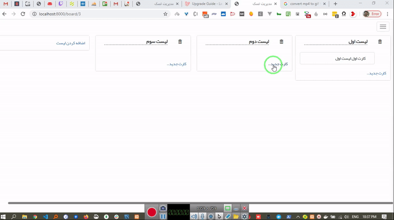

## Installation

You can install using the following way:

-   Clone the project git clone `git@github.com:saber13812002/trello-clone-laravel-7-taskulu-open-source.git`
-   Run `composer install` inside the directory composer install
-   Create database and run migrations `php artisan migrate`
-   change `app.php` in config folder locale to `en` or `fa` and also `fallback_locale`
-   change the `admin.php` config file in config folder default language to `en`
-   Run the server `php artisan serve`
-   Run `php artisan admin:create-user`
-   login into localhost:8000/admin
-   add 1- board 2- department 3- user into menu in admin panel
-   see details about log viewer in `log file` section in this page
-   add link in admin panel http://localhost:8000/admin/logs

### create new card and set color to cards and tags

## Features:

-   Register user
-   Login user
-   Create Board
-   Change Language ( and you can add your language file)
-   Admin panel ( laravel-admin.org )
-   Voyager admin panel ( second level admin panel )
-   statistics in admin panel as charts
-   create cards
-   add tags and comments and description and checklist to the cards
-   Support Jalali calendar and gerigorian calendar and Hijri Calendar
-   new features here: [ branches ](https://github.com/saber13812002/trello-clone-laravel-7-taskulu-open-source/branches)
-   add menu into admin panel :

          - departments
          - logs
          - users
          - boards
          - board-cards

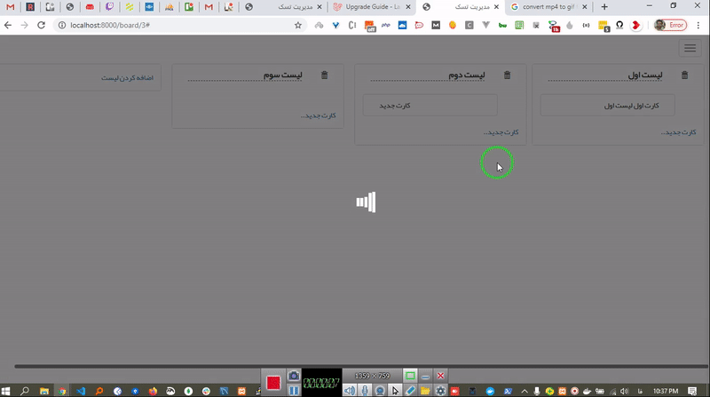

### steps:

1.  installation
1.  admin login
1.  admin need to define departments
1.  then need to register new user as department admin. Note: new users cant create board.
    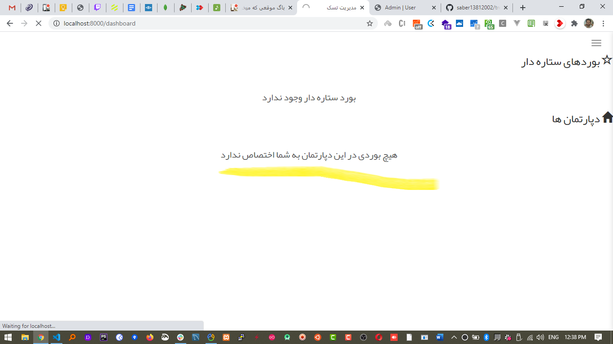
    this is dashboard page. all new users cant see the button to create new board. just dep admin can.
    -first you to need approve any user
    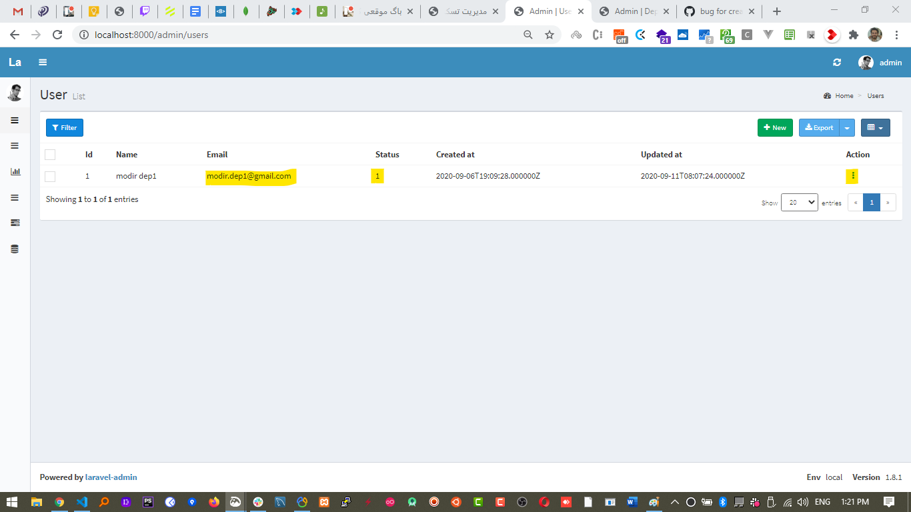
    -second need to set this user as department admin
    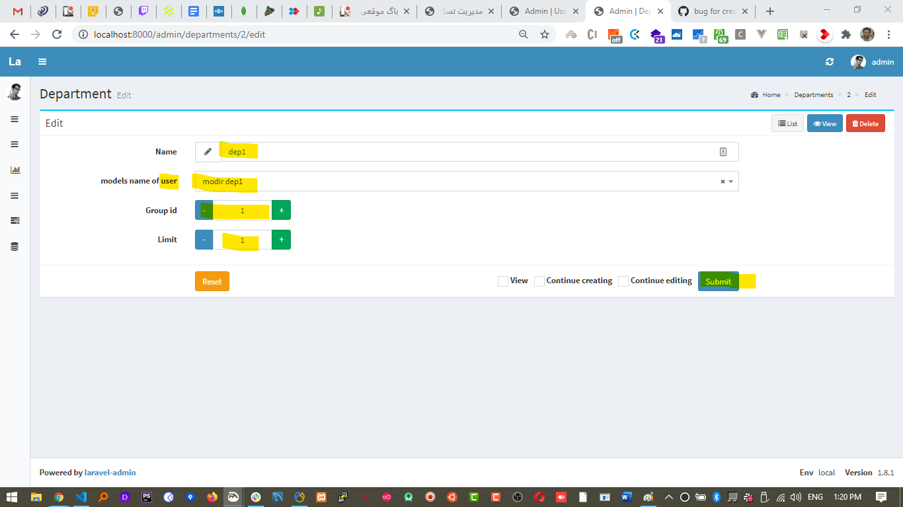

1.  next admin need to grant access to dep.admin ( login to admin panel for example http://localhost:8000/admin/users/1 open this first user and change status to 1)
1.  next is (dep.admin) create his boards
    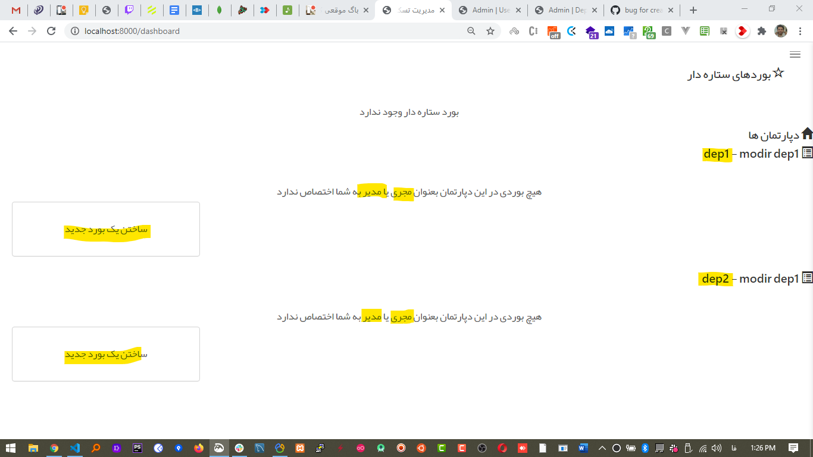
    this is dashboard for admin when he can create new board
    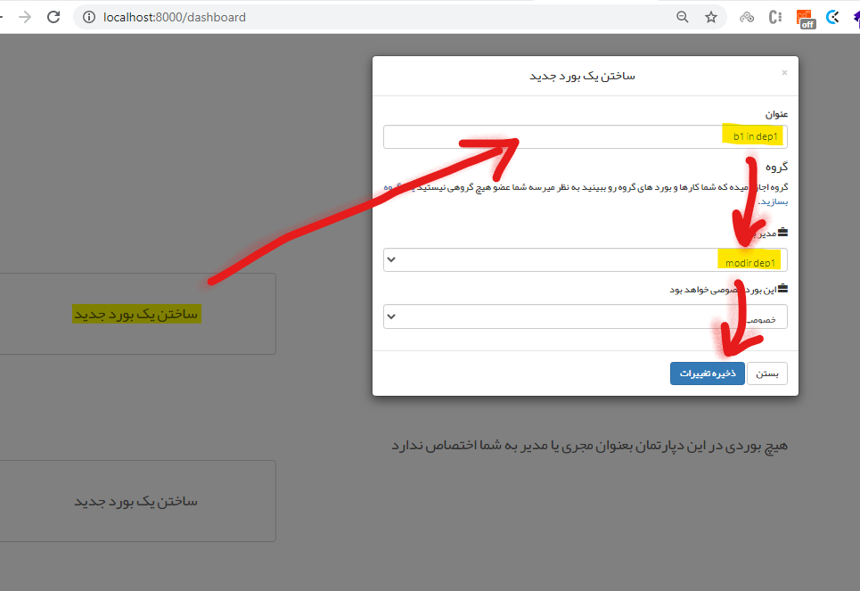
1.  another new user need to register as board1dep1manager@gmail.com for example
    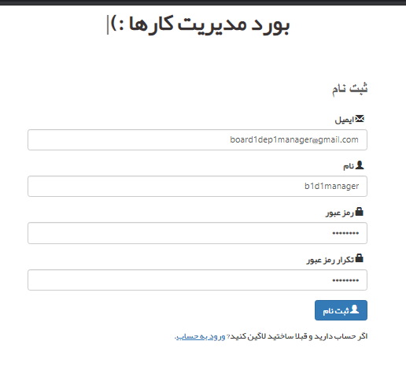
    you should enable this new user by admin panel before he want to login.
    all unapprover users cant login
1.  dep admin can set all approved user as board manager
1.  System admin can set any approved user as board admin
1.  after create boards, dep admin can set manager later from board setting
    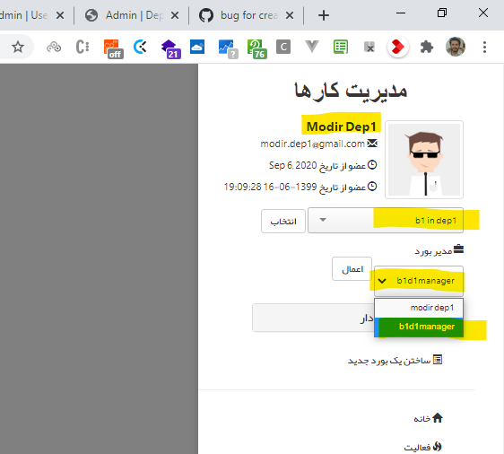
1.  board manager see his boards Green color
    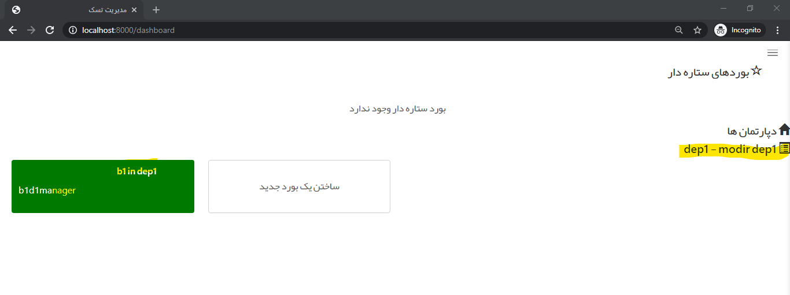
    if this user set as admin for two or more departments he can see his dep name in separate section
1.  board managers can create list for card
1.  board managers can create card in every list.
    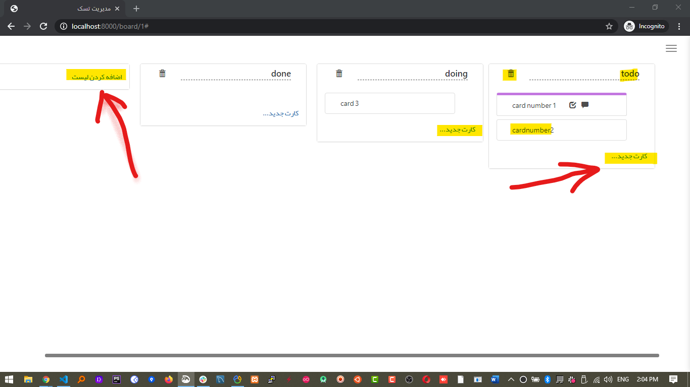
1.  board manager can assign card manager to every card
    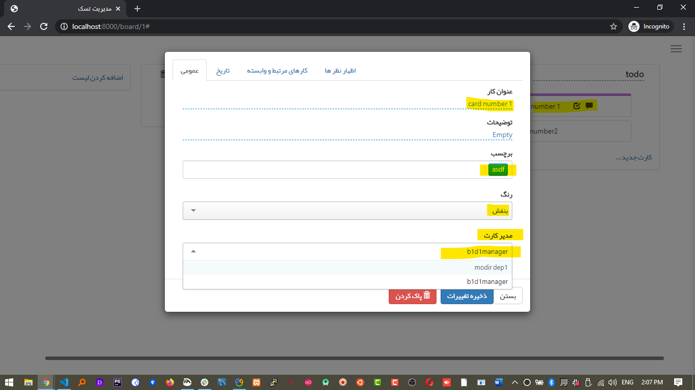
1.  create a new user like dep1b1card1man@gmail.com and approve it from admin panel then set as card manager
1.  card manager can assign memeber for any task via (check list tab) in card
1.  system admin can change card's managers via admin panel : http://localhost:8000/admin/board-cards

### set card details and subtasks

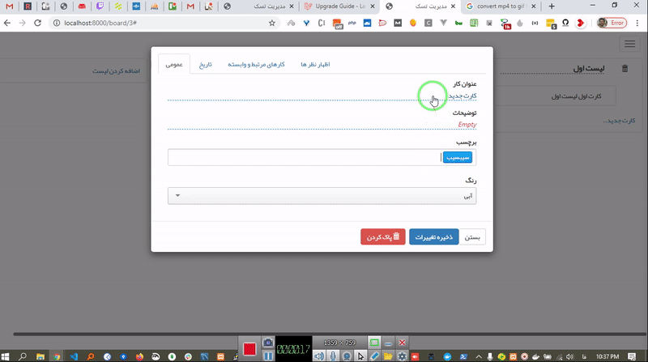

### add comments to it and interact with other teammates

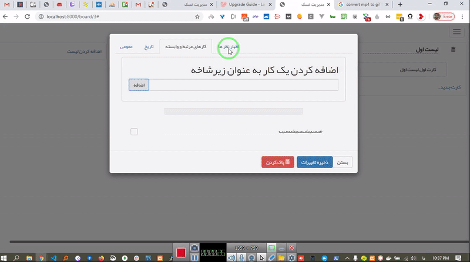

## install on cpanel

just need to run install.bat

## Log file

     $ composer require laravel-admin-ext/log-viewer -vvv

     $ php artisan admin:import log-viewer

     Open http://localhost/admin/logs.

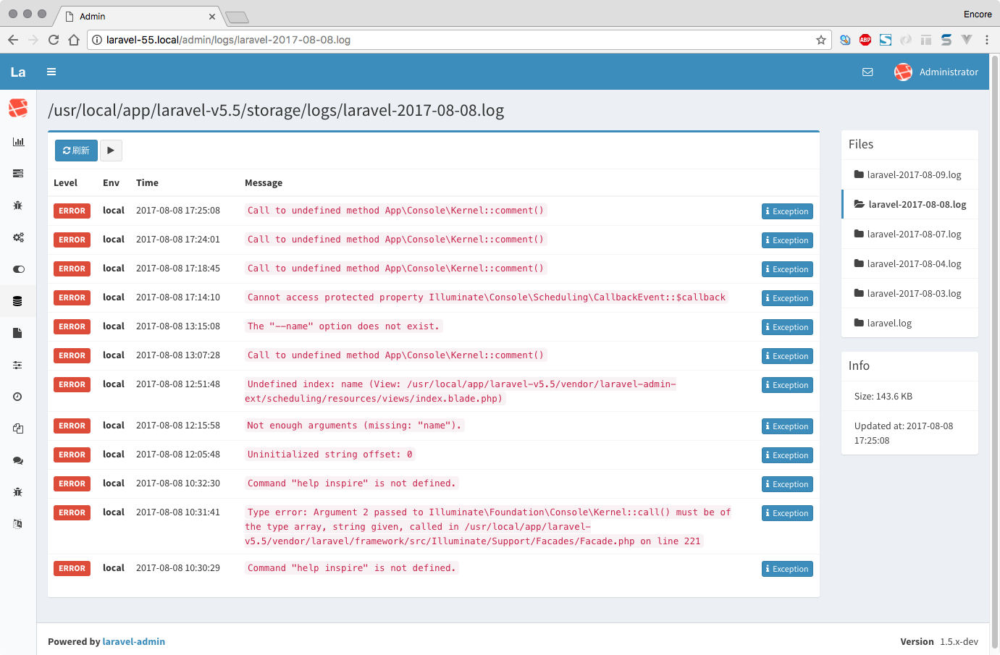

## About Laravel

Laravel is a web application framework with expressive, elegant syntax. We believe development must be an enjoyable and creative experience to be truly fulfilling. Laravel takes the pain out of development by easing common tasks used in many web projects, such as:

-   [Simple, fast routing engine](https://laravel.com/docs/routing).
-   [Powerful dependency injection container](https://laravel.com/docs/container).
-   Multiple back-ends for [session](https://laravel.com/docs/session) and [cache](https://laravel.com/docs/cache) storage.
-   Expressive, intuitive [database ORM](https://laravel.com/docs/eloquent).
-   Database agnostic [schema migrations](https://laravel.com/docs/migrations).
-   [Robust background job processing](https://laravel.com/docs/queues).
-   [Real-time event broadcasting](https://laravel.com/docs/broadcasting).

Laravel is accessible, powerful, and provides tools required for large, robust applications.

## Learning Laravel

Laravel has the most extensive and thorough [documentation](https://laravel.com/docs) and video tutorial library of all modern web application frameworks, making it a breeze to get started with the framework.

If you don't feel like reading, [Laracasts](https://laracasts.com) can help. Laracasts contains over 1500 video tutorials on a range of topics including Laravel, modern PHP, unit testing, and JavaScript. Boost your skills by digging into our comprehensive video library.

## Contributing

Thank you for considering contributing to the Laravel framework! The contribution guide can be found in the [Laravel documentation](https://laravel.com/docs/contributions).

## Code of Conduct

In order to ensure that the Laravel community is welcoming to all, please review and abide by the [Code of Conduct](https://laravel.com/docs/contributions#code-of-conduct).

## Security Vulnerabilities

If you discover a security vulnerability within Laravel, please send an e-mail to Taylor Otwell via [taylor@laravel.com](mailto:taylor@laravel.com). All security vulnerabilities will be promptly addressed.

## License

The Laravel framework is open-sourced software licensed under the [MIT license](https://opensource.org/licenses/MIT).
